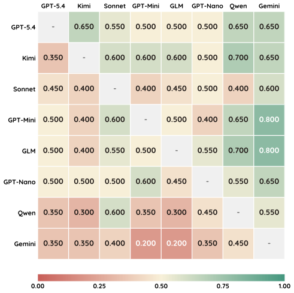
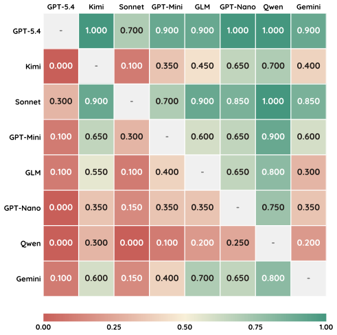
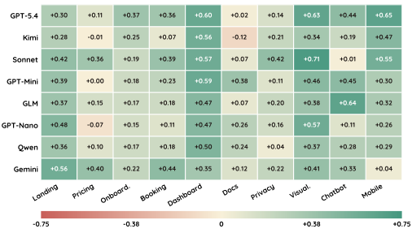

<p align="center">
  
</p>

<h1 align="center">UXBench</h1>

<h3 align="center">
  Measuring the <strong>Actionability</strong> of LLM-Generated UX Critiques
</h3>

<p align="center">
  <a href="https://www.python.org/">
    
  </a>
  <a href="https://github.com/astral-sh/uv">
    
  </a>
  <a href="https://playwright.dev/">
    
  </a>
  <a href="LICENSE">
    
  </a>
  <a href="#-the-eight-judges">
    
  </a>
  <a href="#-fixture-families">
    
  </a>
  <a href="#-human-validation">
    
  </a>
</p>

> **A model that _answers_ a UX question is not the same as a model that _fixes_ the interface.**  
> UXBench scores LLM UX judges by whether a **fixed** downstream repair agent can act on their critique — not by how convincing the critique sounds.

<p align="center">
  <a href="#-overview">Overview</a> ·
  <a href="#-results-at-a-glance">Results</a> ·
  <a href="#-leaderboard">Leaderboard</a> ·
  <a href="#-how-uxbench-works">Method</a> ·
  <a href="#-fixture-families">Fixtures</a> ·
  <a href="#-human-validation">Human Validation</a> ·
  <a href="#-quick-start">Quick Start</a> ·
  <a href="#-cli-reference">CLI</a> ·
  <a href="#-repository-layout">Repo Layout</a> ·
  <a href="#-citation">Citation</a>
</p>

---

## 🔭 Overview

Large language models are increasingly used as **UX judges**: they inspect interfaces, diagnose usability problems, and propose repairs. However, a critique that sounds persuasive is not necessarily useful to a repair agent.

**UXBench** evaluates whether an LLM-generated UX critique is **actionable**.

Instead of scoring the critique directly, UXBench measures whether a **fixed downstream code-editing repair agent** can use that critique to improve the interface. The repaired interface is then scored by a **fixed evaluator** on the same UX rubric.

The core signal is:

$$
\Delta = \text{score(repaired interface)} - \text{score(original interface)}
$$

Because the repair agent, scorer, fixtures, and rubric are held fixed, differences in \(\Delta\) primarily reflect the quality of the judge model’s report.

---

## ✨ What UXBench Measures

UXBench is designed around three principles:

| Principle | Meaning |
| --- | --- |
| **Interaction-grounded judging** | Judges must explore runnable web fixtures in a real browser before writing reports. |
| **Evidence-tied critique** | Each finding must be connected to observed interaction evidence, not just visual impressions. |
| **Fixed downstream evaluation** | The repair agent and scorer are fixed, so benchmark differences come from the judge report. |

Each judge model performs two variable stages:

1. **Explore** a local-first web fixture with browser actions under a coverage gate.
2. **Report** a structured UX critique over seven rubric dimensions.

Then UXBench holds everything else fixed:

3. A **fixed repair agent** edits the fixture from the report.
4. A **fixed scorer** evaluates the repaired interface.

---

## 💡 Results at a Glance

UX judging is **measurable, useful, and still unresolved**. All eight judges improve the same fixtures under the same fixed repair-and-scoring pipeline, but they differ in aggregate lift, rubric signature, fixture-level reliability, and surface-family competence.

| # | Finding | Takeaway |
| --- | --- | --- |
| **1** | **Judges differ in actionable report quality** | GPT-5.4 lifts the benchmark **+0.22** and Gemini-3.1-Pro **+0.14**, giving a 0.08 spread on the 1–5 rubric. UX report generation is **not saturated** among frontier models. |
| **2** | **Each judge has a distinct rubric signature** | GPT-5.4 is strongest on *error recovery*, Kimi-K2.5 on *feedback & trust*, Claude-Sonnet-4.6 on *goal-state clarity*, and Qwen-3.6-Plus on *flow & scanability*. |
| **3** | **Fixture-level reliability varies** | The highest-mean judge has a wide site-level range, while some lower-mean judges are tighter. A judge can be highly actionable on some interfaces and weak on others. |
| **4** | **Competence is surface-conditioned** | The leading model changes across surface families; no judge dominates all ten. Docs and pricing admit high repaired scores, while dashboards and chatbots remain harder. |
| **5** | **Pairwise win rates expose stability** | Mean scores hide whether a lead is broad or driven by a few fixtures. The win-rate matrix shows a **top cluster**, not one runaway model. |
| **6** | **Humans confirm the signal, then sharpen the top** | Blind expert review broadly supports the automated ranking but compresses it into a top-tier cluster: **GPT-5.4** and **Claude-Sonnet-4.6**. |

---

## 🏆 Leaderboard

Every judge starts from the **same unrepaired baseline: 3.27 / 5.0**.

The table reports the repaired mean and its lift \(\Delta\) under the automated repair-lift scorer.

| Rank | Judge Model | Provider | Repaired | Δ vs. Baseline |
| :---: | --- | --- | :---: | :---: |
| 🥇 **1** | **GPT-5.4** | OpenAI | **3.49** | **+0.22** |
| 🥈 **2** | **Kimi-K2.5** | Moonshot | 3.48 | +0.21 |
| 🥉 **3** | **Claude-Sonnet-4.6** | Anthropic | 3.45 | +0.19 |
| 4 | GPT-5.4-Mini | OpenAI | 3.45 | +0.19 |
| 5 | GLM-5.1 | Zhipu | 3.45 | +0.17 |
| 6 | GPT-5.4-Nano | OpenAI | 3.44 | +0.17 |
| 7 | Qwen-3.6-Plus | Alibaba | 3.42 | +0.15 |
| 8 | Gemini-3.1-Pro | Google | 3.41 | +0.14 |

<sub>Repaired scores are on the 1–5 rubric, sorted by automated Δ over the shared baseline of 3.27. All eight lifts are statistically significant over each fixture's own baseline: paired <em>t</em> / Wilcoxon, <em>p</em> &lt; 0.05.</sub>

---

## 📊 Model Comparison

### Pairwise win rate

Mean scores can hide whether a model’s lead is broad or driven by a small number of fixtures. Each cell below is \(P(\text{row beats column})\) on shared fixtures.


| Automated scorer | Blind human review |
| :---: | :---: |
|  |  |

## ⚙️ How UXBench Works

UXBench fixes everything downstream of the judge. Only **Explore** and **Report** depend on the judge model under test.

| Stage | Owner | What Happens |
| --- | --- | --- |
| **1 · Explore** | Judge model | Prescans the fixture, forms a plan, then observes, acts, and inspects feedback in a real browser under a coverage gate. |
| **2 · Report** | Judge model | Writes an evidence-grounded UX critique over seven dimensions, with each finding tied to an observed interaction event. |
| **3 · Repair** | 🔒 Held fixed | A fixed code-editing agent edits the fixture from the report while preserving the original product intent and brand. |
| **4 · Score** | 🔒 Held fixed | A fixed scorer rates the repaired interface on the same rubric. The delta is the actionability signal. |

---

## 🧭 Rubric

UXBench evaluates repaired interfaces using seven browser-grounded rubric dimensions.

| Dimension | What It Measures |
| --- | --- |
| 🎯 **Goal-state clarity** | Can users quickly grasp the page’s purpose, current state, available options, and the most sensible next action? |
| 🧭 **Navigation scent** | Do labels, menus, tabs, search, and filters give reliable cues toward the right content or next step? |
| 🔔 **Action feedback** | Are actions followed by clear feedback for selection, input, loading, validation, success, and failure? |
| 🔁 **Flow efficiency** | Can users complete multi-step or cross-page tasks without detours, repetition, waiting, or backtracking? |
| ↩️ **Error recovery** | Does the interface prevent likely mistakes and offer clear ways to correct, undo, retry, or return? |
| 🛡️ **Trust transparency** | Before committing, can users understand costs, permissions, privacy choices, and consequences? |
| 👁️ **Scanability & accessibility** | Is the page easy to scan, visually prioritized, readable across screen sizes, and operable with basic accessibility cues? |

---

## 🗂️ Fixture Families

UXBench contains **41 fixtures** across **10 surface families**.

The benchmark includes **11 real-product anchors** shown in bold, plus **30 independently authored synthetic siblings**.

| Family | # | Fixtures |
| --- | :---: | --- |
| Landing Page | 4 | **notion**, pelagic, meadowos, stratabox |
| Pricing Page | 4 | **slack**, codekite, lattice, vaultkey |
| Onboarding | 5 | **shopify**, **govuk-passport**, solstice-bank, greengrove, civicport |
| Booking | 4 | **booking**, orbitride, moonlight-tickets, tablerose |
| Dashboard | 4 | **cloudflare-radar**, fleetatlas, aeroiq, pulsegrid |
| Documentation | 4 | **stripe-docs**, tessera, weaveapi, runeforge-docs |
| Privacy / Settings | 4 | **microsoft-privacy**, privacy-dashboard, aurora-network, meadowid |
| Data Visualization | 4 | **owid-population**, fred-unrate, **climate-almanac**, migration-atlas |
| Chatbot / Agent | 4 | **chatgpt**, lumen-research, forge-coder, atlas-tutor |
| Mobile UI | 4 | **ridenow**, brewlog, harborwallet, larkfit |

---

## 🔬 Human Validation

UXBench also includes a **blind expert review** protocol. Model identities are hidden, and humans review every repaired interface.

The automated and human protocols agree directionally, but not perfectly. Human review compresses the top of the leaderboard into a stronger top-tier cluster: **GPT-5.4** and **Claude-Sonnet-4.6**.

<div align="center">
  
</div>

## 🚀 Quick Start

### Prerequisites

| Tool | Version | Notes |
| --- | --- | --- |
| Python | 3.10+ | Installed via `uv` |
| [uv](https://github.com/astral-sh/uv) | latest | Project and environment manager |
| Playwright | bundled | Browser automation runtime |

### 1 · Install

```bash
uv python install 3.10
uv sync
uv run playwright install
```

### 2 · Configure

Run sanity checks:

```bash
uv run uxagent list-providers
uv run uxagent list-models
```

### 3 · Run a bundled fixture

This checkout has **no root-level `websites/` directory**. Benchmark variants live under:

```text
websites-data/<model-or-baseline>/<site>/
```

Therefore, `list-sites` will be empty for the bundled benchmark data. Use **URL mode** instead.

Audit a fixture variant from `websites-data/`:

```bash
SITE="$(pwd)/websites-data/base/booking"
URL="file://$SITE/index.html"

uv run uxagent audit-url \
  --url "$URL" \
  --source-dir "$SITE"
```

Evaluate the same fixture:

```bash
uv run uxagent eval-url \
  --url "$URL" \
  --source-dir "$SITE"
```

Or point UXAgent at any running local or remote server:

```bash
uv run uxagent audit-url \
  --url http://localhost:3000 \
  --source-dir /absolute/path/to/site

uv run uxagent eval-url \
  --url http://localhost:3000 \
  --source-dir /absolute/path/to/site
```

---

## 🛠️ CLI Reference

```bash
uv run uxagent --help
```

| Command | Purpose |
| --- | --- |
| `audit` | Explore a site under root-level `websites/` and produce UX feedback. |
| `eval` | Judge a site under root-level `websites/` and produce a score. |
| `audit-url` | Audit any `file://`, local server, or remote URL. |
| `eval-url` | Evaluate any `file://`, local server, or remote URL. |
| `feedback-fix` | Copy a baseline site and apply a `feedback.json` with Claude Code. |
| `list-sites` | List sites under root-level `websites/`. |
| `list-providers` | List configured providers. |
| `list-models` | List configured models for a provider. |

### Common options

```bash
--max-steps 80
--exploration-depth quick|standard|deep|exhaustive
--viewport desktop|mobile|both
--headed | --headless
--provider openai
--model gpt-5.4-mini
--out runs
```

`eval` and `eval-url` also accept:

```bash
--judge-rubric default|controls
```

### Applying fixes

`audit` can ask Claude Code to apply fixes after the report. In URL mode, `--source-dir` is required.

```bash
uv run uxagent audit \
  --site booking \
  --claude-fix

uv run uxagent audit-url \
  --url http://localhost:3000 \
  --source-dir /abs/path/to/site \
  --claude-fix
```

For an existing `feedback.json`, drive the repair stage directly:

```bash
uv run uxagent feedback-fix \
  --feedback Agent-run-results/results-gpt-5.4-mini/booking/feedback.json \
  --baseline-site-dir websites-data/base/booking \
  --out feedback-fixes
```

Fix-related options:

```bash
--claude-exe
--claude-model
--claude-permission-mode
--claude-allowed-tools
--fail-on-claude-fix-failure
```

---

## 📁 Repository Layout

```text
UXBench/
├── uxagent/             # Python CLI package: explore · report · repair · score
├── websites-data/       # Benchmark fixtures: <model-or-baseline>/<site>/
│   ├── base/            # Shared unrepaired baselines
│   ├── gpt-5.4/         # Per-judge repaired variants
│   └── …
├── Agent-run-results/   # Saved agent run artifacts: reports, feedback, traces
├── results/             # Curated figures, tables, statistical tests, source data
├── paper-site/          # Project website; figures rendered from results/
├── paper/               # Paper source
├── viewer/              # Browser-based result and dataset viewer
└── tools/               # Maintenance scripts
```

---

## 📄 License

This project is released under the [MIT License](LICENSE).

---

## 📚 Citation

Citation information will be added with the paper release.
